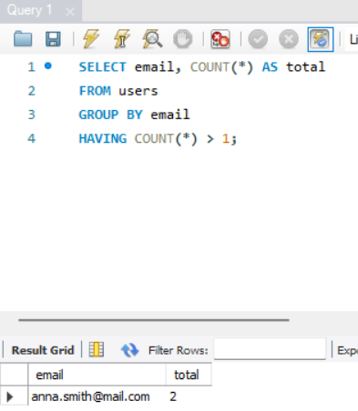
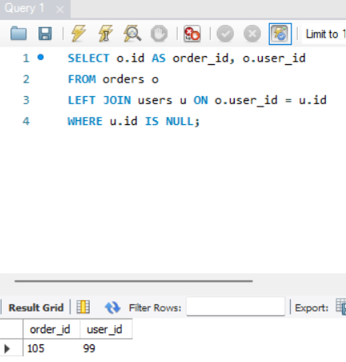

# SQL for QA — Data Validation

Manual data validation project using SQL to check data integrity in a sample e-commerce-style database, performed as part of a self-directed QA portfolio. This exercise demonstrates the ability to verify data at the database layer — finding duplicate records, broken relationships, and invalid values that a UI or API test alone would not catch.

## Why This Exercise

Manual QA testing typically validates what a user sees in the UI. This phase goes one level deeper: it checks whether the underlying data is actually correct and consistent, which is a skill QA engineers are expected to have when working with databases, APIs, and backend systems. A custom sample database was built (rather than using a pre-made dataset) to mirror the SauceDemo domain already covered in the UI testing phase (users, products, orders) and to allow full control over the data scenarios being tested.

## Tools Used

| Tool | Purpose |
|---|---|
| MySQL | Running SQL queries against the sample database |
| Custom SQL script | Creating and seeding the sample database (`setup.sql`) |

## Database Structure

| Table | Purpose |
|---|---|
| `users` | Customer accounts |
| `products` | Catalog items |
| `orders` | Orders placed by users |
| `order_items` | Line items linking orders to products |

## Validation Coverage

| Metric | Result |
|---|---|
| Basic queries practiced | 10 |
| Data validation queries written | 8 |
| Data issues identified | 6 |
| Tables covered | 4 of 4 |

Full list of queries, with explanations and results, is in [`SQL_Validation_Queries.xlsx`](./SQL_Validation_Queries.xlsx).

## Key Findings

1. **Duplicate user account by email.** A query grouping `users` by `email` and filtering with `HAVING COUNT(*) > 1` returned a duplicate record — two separate `id`s (1 and 5) registered under the same email address, `anna.smith@mail.com`. In a real system this would indicate either a missing unique constraint on `email` or a signup-flow bug allowing duplicate registrations.

   ```sql
   SELECT email, COUNT(*) AS total
   FROM users
   GROUP BY email
   HAVING COUNT(*) > 1;
   ```

2. **Orphaned foreign key in orders.** A `LEFT JOIN` between `orders` and `users` with a `WHERE users.id IS NULL` filter revealed an order (`id = 105`) referencing `user_id = 99`, which does not exist in the `users` table. This is a referential integrity issue — the kind of defect that's invisible in the UI (the order simply wouldn't display correctly) but is immediately obvious at the data layer.

   ```sql
   SELECT o.id AS order_id, o.user_id
   FROM orders o
   LEFT JOIN users u ON o.user_id = u.id
   WHERE u.id IS NULL;
   ```

Additional issues found during validation: a `NULL` email on one user record, a `NULL` status on one order, an `order_items` row referencing a non-existent `product_id`, and a negative `quantity` value on another `order_items` row — all documented with their queries in the full query list.

## How to Reproduce

1. Open MySQL Workbench (or any MySQL client) and connect to a MySQL server.
2. Paste and run [`setup.sql`](./setup.sql) to create and populate the four tables.
3. Run the queries listed in [`SQL_Validation_Queries.xlsx`](./SQL_Validation_Queries.xlsx) to reproduce each finding.

## Folder Contents

```
/sql-validation
├── README.md                        ← this file
├── setup.sql                        ← script to create and seed the sample database
├── SQL_Validation_Queries.xlsx      ← full list of queries with explanations and results
└── screenshots/
    ├── duplicate-user-query.png
    └── orphaned-order-query.png
```

## Screenshots

**Duplicate user query result**


**Orphaned order query result**

